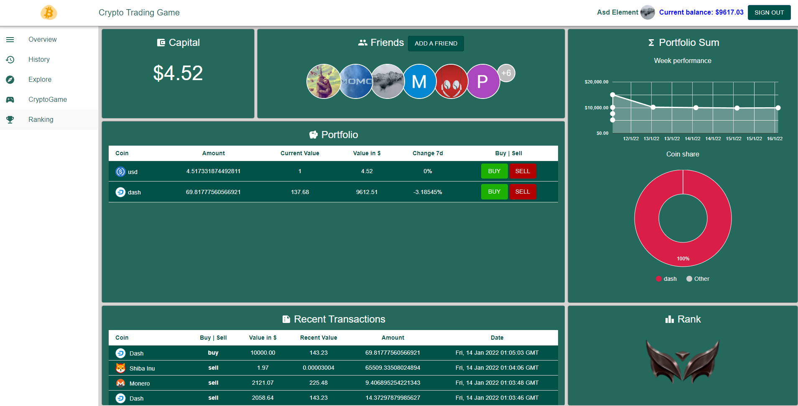

<!-- PROJECT LOGO -->
 

  

  <h3 align="center">Crypto Trading Game</h3>

  

    A webtechnologie project 
     
    <a href="https://crypto-game-wt.web.app/">View Demo</a>
  

## About The Project

  

## Built With

### Frontend

* [React](https://reactjs.org/)
* [Material Ui](https://mui.com/)

### Backend 

* [Node.js express](https://expressjs.com/)
* [Mongodb](https://www.mongodb.com/)

### Deployment 

* [Okteto](https://okteto.com/)
## Available Scripts

In the project directory, you can run:

### `npm start`

Runs the app in the development mode.\
Open [http://localhost:3000](http://localhost:3000) to view it in the browser.

The page will reload if you make edits.\
You will also see any lint errors in the console.
